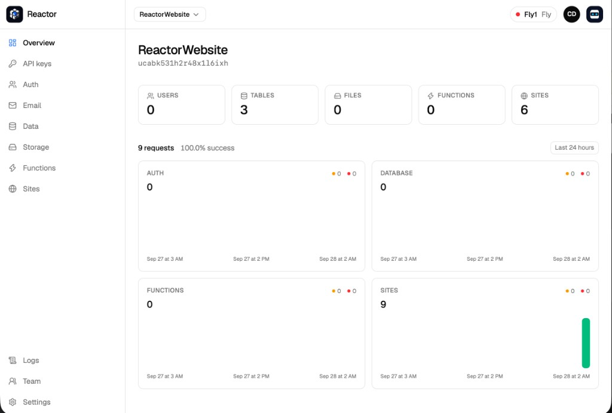

# Console

Admin UI for a Reactor cluster. Operators sign in here to create projects, browse data and files, and ship functions and sites. Project users do not use this app.

With the server running, open [http://127.0.0.1:18000/console](http://127.0.0.1:18000/console).

[reactor.cloud](https://www.reactor.cloud)



## Pages

| Page | What you do there |
| --- | --- |
| Projects | Create a project and open it |
| Overview | Name, counts, and the last 24 hours of traffic |
| API keys | Anon key, service key, rotate |
| Auth | Project users |
| Data | Tables and rows |
| Storage | Files for the project |
| Functions | Versions, logs, variables, and a test call |
| Sites | Deployments, domains, and site variables |
| Logs | Recent function and site lines |
| Team | Invite operators |
| Settings | Rename or delete the project |

A platform admin also sees Cluster and Console users. The cluster pill shows the name, where it runs, and whether it is healthy.

## Develop

The server serves `console/dist`. From this directory:

```sh
npm install
npm run build
```

`npm run dev` starts Vite on its own port. API calls go to the Reactor server, so use the built console on port 18000 when you need a working session.

Full page notes: [console](../docs/operate/console.md).

## License

You can use Reactor as the backend for as many personal or commercial projects as you want. The license only restricts offering it as a competing hosted service.

Business Source License 1.1. Copyright 2026 AtomicoLabs SL and Claudio del Conde. See [LICENSE](../LICENSE).
